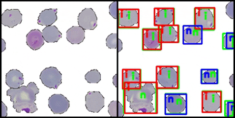

# Objective: 
This project shows a deep learning based approach to detect and identify different types of blood cells and also detect the presence of malarial parasites in the blood. This algorithm takes in digitized blood smear images and then uses modified versions of YoloV2 model to identify the different objects with an overall mean average precision of 0.97.

**A *Trailer* of Final Result:**

[**YouTube Link**](https://youtu.be/NkO_WeDJ9Ng)

---

This project is to create a neural network to classify and detect the locations of different types of blood cells from a digital blood smear image.

The neural network used here is a modified version of the [Yolo-V2](https://arxiv.org/abs/1612.08242v1) convolutional neural network. The pdf of the paper is also present [here](extra_files/YoloV2_paper.pdf).
The whole idea is that, a big digitized blood smear image (may be 1000 x 1000 pixels) will be obtained from a digital microscope and then it will be broken up into **224 x 224** segments. These segments will be given to the network to detect and classify the different objects. Then after the inference is done, these 224 x 224 segments are stitched back to the size of the original image (from the microscope). The RGB colored image obtained from a digital microscope showing the different blood cells in a blood smear on a slide at **40x** magnification.
The locations of the identified objects are marked by the network using bounding boxes. So there has to be ground truth bounding box information in the training dataset as well.
The network is first trained using a training dataset and validated with a validation dataset. After that it has to tested on a completely unseen test dataset to check its performance.
The images in the dataset used here has the following types of cells: **2** types of RBCs: **Infected RBC** (RBCs infected with malarial parasite), **Healthy RBC**; 
**5** types of WBCs: **Eosinophil**, **Basophil**, **Neutrophil**, **Lymphocytes**, and **Monocytes**; 
**2** types of Platelets: **Thrombocytes** (individual platelet cells) and **Platelet Clumps** (bunch of platelets appearing as a cluster).
So overall there are **9** objects.

# Dataset Creation:
The images used for creating the training, testing and validation datasets are obtained from four different databases: 
* [**Leukocyte Images for Segmentation and Classification (LISC) database**](http://users.cecs.anu.edu.au/~hrezatofighi/publications.htm): This contains images of five types of WBCs on a background of RBCs. The images are labeled by the type of WBC in them, and each image also has a binary mask that indicates the pixels representing the WBC region.
* [**Isfahan University of Medical Science (IUMC) database**](https://misp.mui.ac.ir/fa): This has labeled images of individual WBCs with their binary masks. However, this database does not have Basophil images.
* [**MAMIC database**](http://fimm.webmicroscope.net/Research/Momic): It has large blood smear images of healthy RBCs, THRs, Platelet clumps and Malaria infected RBCs. Occasionally, WBCs also appear in the MAMIC images, but they are not labelled. Every image contains multiple cells, without any binary masks to separate them.
* [**KAGGLE database**](https://www.kaggle.com/iarunava/cell-images-for-detecting-malaria): This contains images of individual healthy and infected RBCs, but without any binary masks. All the Malarial infection images in the last two databases are with Plasmodium Falciparum pathogen.

The main reason to combine all these different databases is the unavailability of a single annotated database that contains all types of blood cells (mentioned earlier) along with malaria infected RBCs.

For a robust training of the CNN, the training dataset should have a wide variety of combinations of the different blood cells. 
For example, there should be images with an Eosinophil and a Basophil with healthy RBCs in the background, images with a Monocyte and Platelet clumps on a background containing both healthy and infected RBCs, images containing only Lymphocytes on a background of infected RBCs, etc. None of the databases mentioned earlier has this much variety. 
Additionally, total number of WBC images over all the databases is around **391**, which is not sufficient for a good training. Hence, a fresh dataset was created which has the desired variations, using images from the previously mentioned databases as building blocks.

As a first step, a set of images is created that has only one kind of cell in them along with their binary masks. This is done for the LISC, KAGGLE, and MAMIC images. IUMC images are already in this format. 
The region of WBCs in the LISC images are cropped off using their masks to create individual images of WBCs. LISC and IUMC provides all the required WBC samples. 
One set of infected and healthy RBCs are obtained from KAGGLE. THRs, Platelet clumps and another set of infected and healthy RBCs are cropped out manually from several MAMIC images. 
The binary masks of the samples obtained from KAGGLE and MAMIC are created using simple image thresholding technique. 
Finally, all these newly created samples are resized such that they are similar in size to cells seen under a microscope with **40x** magnification.

Some of these resized image samples and their binary masks used for creating training, testing, and validation datasets are shown below:

A: Basophil cropped from an LISC image, B: Eosinophil from IUMC, C: Healthy RBC cropped from a MAMIC image, D: Infected RBC cropped from a MAMIC image, E: Healthy RBC from KAGGLE, F: Infected RBC from KAGGLE, G: Platelet clump cropped from a MAMIC image, H: THR cropped from a MAMIC image.

The total number of samples obtained in this manner for different cells is given below: 

| Cell Types | LISC | IUMC | MAMIC | KAGGLE |
|:----------:|:----:|:----:|:-----:|:------:|
| Eosinophil | 37 | 42 | - | - |
| Basophil | 50 | - | - | - |
| Neutrophil | 47 | 38 | - | - |
| Lymphocyte | 45 | 32 | - | - |
| Monocyte | 48 | 36 | - | - |
| Thrombocyte | - | - | 82 | - |
| Platelet clump | - | - | 36 | - |
| Infected RBC | - | - | 407 | 13779 |
| Healthy RBC | - | - | 3539 | 13779 |

**The following flowchart shows how the training, testing and validation datasets are created.**

First, all of the different types of image samples shown in the above table are separated into three groups namely: **training samples** (comprising **80%** of all the samples), **testing samples** (comprising **10%** of all the samples) and **validation samples** (comprising **10%** of all the samples). Only images from the training samples set are used to create the synthetic training dataset. Similarly, only images from the testing and validation samples sets are used to create the images for testing and validation datasets, respectively. This is done so that there are no common samples between the three datasets created and the neural networks never see any testing samples during training.

The size of the images in these datasets are **224 x 224** pixels. At first, some **1000 x 1000** background images are created that contain only RBCs in them. This is done by affixing randomly selected RBC samples on a blank image at random places. These locations are also recorded in a separate list. Altogether, **1500** such background images are created. **500** of these have only infected RBCs, **500** have only healthy RBCs, and **500** have a mix of both. Then, **224 x 224** blocks are cropped out of these images from random locations and WBC, THR and Platelet clump samples are affixed in them randomly. For each such image, the class names of the objects and the position and size of their bounding boxes are recorded in a separate list. The samples are also rotated at random angles while affixing them. 3 sample images obtained are shown in following figure.

### Partially Visible WBC case:
A completely digitized blood smear image from a microscope at 40x magnification, is huge in size and cannot fit into 224 x 224 pixels. Such an image has to be broken down into segments and sent into the CNN as a batch of 224 x 224 images. The CNN produces the inference output on this batch of images which are then stitched back to the original size. 
While creating the batch of 224 x 224 images, it may happen that some WBCs may fall at the boundary of two adjacent segments and only be partly visible in the image. Therefore, there may not be enough features visible to identify such WBCs correctly. 
Hence, while creating the training dataset, some images are deliberately created with the WBC only partially visible in them, as shown in the above figure. In some of these images only half of the cell is visible and in some others only one quarter may be visible. These WBCs are classified as a separate class called **Partial WBC** and the type of WBC is not specified. 
So, the total number of classes is now **10** including the Partial WBC class.

After stitching back the batch of output images from the CNN, if any Partial WBC appears in it, then an inference is carried out for a second time on a 224 x 224 square around the location of the Partial WBC in the original image. This time the WBC is fully included in the image and hence a proper detection result is obtained. The Partial WBC is then replaced with the new result to improve detection accuracy. 
No image is created where THR and Platelet clumps are partially visible because their partial and complete form has similar visual features and they can be classified correctly regardless how much is visible. However, if any THR or Platelet clump becomes partially visible in a 224 x 224 image, then there will be two of these objects detected adjacent to each other when the images are stitched together for final detection. Thus, to prevent over-counting, the same approach of a second inference around these adjacent objects is taken, just like the case of Partial WBCs.
A flowchart of this entire process is shown in the following figure:

The total number of images in the final training, testing and validation sets are **65350**, **6560**, and **6560** respectively. All possible combinations of cells are present in among these images. 

But the datasets being too big are not added to this github repository. Some sample images are given in the [trial/images](trial/images) folder. Each of these images has a json file associated with them which contains the details of the objects present in the image along with the dimensions of the bounding box for that object. These are given in the [trial/labels](trial/labels) folder.

# Current Framework: 
* Tensorflow 1.7.0 (with GPU preferred). 
* Opencv libraries, Ubuntu 16.04, Python 3.6.3 (Anaconda).
* This training does not necessarily needs GPUs, but they will make it much faster. This model is trained on one **NVIDIA P6000 Quadro GPU** in the [**Paperspace**](https://www.paperspace.com/) cloud platform.

# Modified Yolo-V2 Architecture:
The [Yolo-V2](extra_files/YoloV2_paper.pdf) model is one of the most widely known model used for object detection task. 

A stripped down version of the Yolo neural network model is considered for training because the original network was too big for our requirements. So the overall model is shrinked in size. This model is shown in the figure below. This model will be henceforth referred to as **ModifiedYolo** model. All the convolution layers (conv) have a leaky Relu activation (with alpha = 0.1) followed by a batch normalization layer at their output. These are not shown in the figure. The last convolution layer opens into a global average pooling layer with a sigmoid activation, since an image may have several different types of cells which are not mutually exclusive. The network is first trained only for classifying the cells in the images. At this stage, it outputs a multi-hot vector of **10** elements, one for each class. 

If the network was trained directly for the object detection, then the overall training error in bounding box coordinates might have overwhelmed the classification error and the network would have focused more on reducing the bounding box location error, thereby neglecting the classification error altogether. The bounding boxes would have been created correctly but the predicted class names might have been wrong.
Hence after the classification training when the classification accuracy has reached about **96.8%** on the validation dataset, the same ModifiedYolo model is trained for object detection to predict the location of the cells and create bounding boxes around them. In this stage, the last convolution layer is replaced by **4** other fresh convolution layers to make the network more powerful and to reshape the last layer into the required number of output elements needed.

The first layer of the network has a height and width of **224 x 224**. This is reduced to **14 x 14** in the last few layers. Each of these 14 x 14 grid cells is a potential location to find an object. For each grid cell, **6 anchor boxes** are predefined, whose dimensions are modified by the network to suit the shape of the detected objects. Each anchor box has **15 elements** for object detection. **Two** of them are offsets for the **x, y coordinates of the center of the bounding box**. The next **two are its height and width**. The **5th** one is a **confidence score** indicating the probability of the presence of an object in that bounding box. The last **10 are a 10 element one-hot vector** for the 10 classes. Therefore the last convolution layer has a depth of **6 x (5 + 10) = 90**. Non-maximum suppression (NMS) was used to remove redundant bounding boxes based on their intersection over union (IOU) score in the same manner as done in original yolo paper.

The network used for detection is shown below:

### Modified Loss Function:

A simplified version of the original loss function used for object detection for yolo is shown below:

**x_err**, **y_err**, **w_err**, **h_err** are the errors between true and predicted values of the center x, y coordinates and width and height of the bounding box. **C_err** is the error in the confidence (that an object is present in the box) and **C'_err** is the error in the confidence (that an object is not present in the box). **Class_err** is the classification error. **lambda_coord** and **lambda_noobj** are multiplying factors that tells the network how much importance should be emphasized on the corresponding errors. 

With this, the network was able to create the bounding boxes properly but the class name prediction was not very accurate. The overall mean average precision (mAP) obtained was 89%. Hence, to improve this, an extra parameter **lambda_class**, was included in the above equation so that the network puts more importance on the class name prediction as well. The modified function is shown in below:

# Scripts and their Functions:
* [**utils_2.py**](codes/utils_2.py): All important functions for creating batches, creating the dataset etc. along with some extra functions are defined here.
* [**tiny_yolo_classifier_2.py**](codes/tiny_yolo_classifier_2.py): The model along with its associated functions are defined here.
* [**training_2.py**](codes/training_2.py): The training process is started using this script.
* [**testing_2_modified.py**](codes/testing_2_modified.py): Evaluates the output.
* [**results.py**](codes/results.py): Detailed result is shown in this file.

# Data Preprocessing, Hyperarameter and a short description of Training:
**[NOTE] All these settings are specified in the [utils_2.py](codes/utils_2.py) file.**
* Images are all resized into **224 x 224 x 3** size before feeding into the network.
* **Batch size: 100**
* **Epochs: 18** for **CLASSIFICATION** phase
* **Learning rate: 0.001 (upto epoch 1 - 15), 0.0001 (epoch 16 - 17), 0.00001 (epch 18)** 
* A record of the **latest maximum validation accuracy** is also kept separately in a variable.
* The trained neural network model is saved if the validation accuracy in the current epoch is **better** than the latest maximum validation accuracy. 

* Images are all resized into **224 x 224 x 3** size before feeding into the network.
* **Batch size: 100**
* **Epochs: 52** for **DETECTION** phase
* **Learning rate: 0.001 (upto epoch 1 - 50), 0.0001 (epoch 51 - 52)** 
* A record of the **latest minimum validation loss** is also kept separately in a variable.
* The trained neural network model is saved if the validation loss in the current epoch is **lower** than the latest minimum validation loss. 

A **json** file is also saved along with the checkpoint, which contains the following details: 
* Epoch, Batch size and Learning rate.
* Mean and Standard deviation of the training set.
* Latest maximum validation accuracy and minimum validation error.
* A statistics of the epoch, learning rate, training loss, training accuracy and validation accuracy upto the current epoch.

These information from this json file are reloaded into the model to restart the training, in case the training process got stopped or interrupted because of any reason.

# Results:
### The final pixel level accuracies of the model are as follows:

The **mean average precision (mAP)** measured over the test dataset was **0.97618**.
Test Loss: 312.268301, **Test Classification Accuracy: 94.680 %**

For the detection of malarial pathogens in RBCs, the true positive and false positive metrics are more suitable.

**RBC Image Precision: 0.998, RBC Image Recall: 0.995, RBC Image F1score: 0.996**

Confusion Matrix for the RBC images of test

|	Test Set	|	Pred_Infection	|	Pred_Normal	|	Not_detected	|
|:-------------:|:-----------------:|:-------------:|:-----------------:|
| True_Infected | 100.000 % (TP) | 0.000 % (FN)	| 0.000 % |
| True_Normal | 0.942 % (FP) | 99.058 % (TN) | 0.000 % |

### Some example predicted input images and segmentation map from the network:

Green is ground truth boxes. Background consists of healthy RBCs. 224x224 image.

Green is ground truth boxes. Background consists of infected RBCs. 224x224 image.

Prediction result on a full blood smear image, with an Eosinophil (E), two Neutrophils (N), infected RBCs (i) and healthy RBCs (n).

### An overall look of the results on several example images is shown below.

The video of this result can also be found on [Youtube](https://www.youtube.com/) at this [link](https://www.youtube.com/watch?v=iXx_U7ga3FU&feature=youtu.be).
